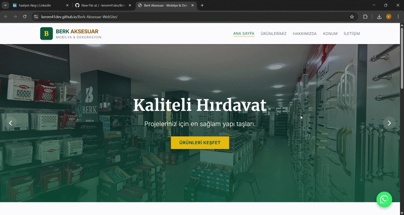

🛒 Berk Aksesuar - WebSite
Sitenin canlı hali: https://kerem41dev.github.io/Berk-Aksesuar-WebSite/

Tüm özellikleri denediğim YouTube videosu: https://www.youtube.com/watch?v=iI18gDf7Ro4

Bu proje, Berk Aksesuar mobilya aksesuarları mağazası için geliştirilmiş, tam responsive (mobil uyumlu) bir mağaza tanıtımı ürün tanıtımı ve iletişim yönetim sistemidir.

🚀 Öne Çıkan Özellikler ve Teknik Detaylar
Modern Arayüz: HTML5 ve CSS3 kullanılarak modern, kullanıcı dostu ve tüm cihazlara uyumlu bir tasarım oluşturuldu.

Dinamik Veri Entegrasyonu: Ürün yönetimi ve veri depolama süreçleri için Supabase veritabanı entegrasyonu sağlandı.

İletişim Formu Çözümü: Müşteri taleplerinin doğrudan yönetilebilmesi için EmailJS kullanılarak aktif bir mail gönderim sistemi kuruldu ve whatsapp iletişim hattı eklendi.

JavaScript (ES6+): Sayfa içi dinamik etkileşimler ve veritabanı sorguları için modern JavaScript pratikleri uygulandı.

🛠️ Teknolojiler
Frontend: HTML5, CSS3, JavaScript.

Backend & Tools: Supabase, EmailJS, GitHub Desktop.
